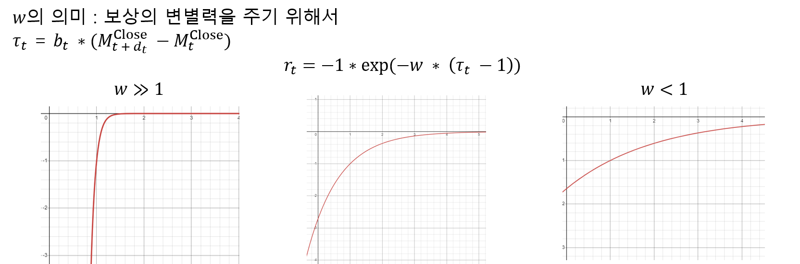

# Stock_RL
난 부자가 되고싶어

주식을 하다가 문뜩 떠오른 생각이 있다. 지금까지 공부한 머신러닝, 딥러닝으로 주가를 예측하거나 매수, 매도 액션의 조언을 구해줄 수 있지 않을까?
참고를 얻기 위해서 구글링을 뒤적뒤적했다. (2020/12)

강화학습으로 주식을 완전히 학습하는 것은 불가능하다.
데이터를 모으고 자동으로 연산하여 숫자로 증명할 수 있는 코드를 짜보자. (2023/03)

## Allocation Planning 

국내 배당주를 분석할 수 있는 코드를 짜보자 
추후 정리 예정

## ML_RSB Project

### 개요
주식은 잘하는법이 없다고 했다. 하지만 옛날부터 주식을 해온사람과 이제 주식을 시작하는 주린이 사이에는 분명히 짬빠가 있을것이다.
옛날부터 주식을 하는 사람을 모델로 구현할 수 있다면 주린이라도 매수 매도에 도움을 주지 않을까?

다시말해, 1~2년 정도의 거래 그래프를 보면 지금 당장 매수해야할지, 매도해야할지 알 수 있을까?
또한, 현재 주가가 저점인지, 고점인지 파악할 수 있지 않을까?

<p align="center"></p>

#### 한계
1. 그래프를 완벽히 분석하고 시장흐름을 완벽힣 안다고해도 주식은 불확실하며 예기치않은 사건이 발생할 수 있다.
2. 그리고 실제 거래를 해보지 않으면 그래프의 고점과 저점차 간의 수익율을 알 수 없다.

#### 기대사항
강화학습의 Sequential decision making은 주식거래에 적용하기 딱맞다.
10~20년 전의 주식상황을 컴퓨터가 수 천, 만 번 경험하게 하여 ML을 시킨다면 매수/매도 policy를 최적화 시킬 수 있을 것이다.

따라서, 주식을 거래하는 시나리오를 만들고, 로봇에게 적절한 보상을 주어 그것을 ML하는 강화학습 process를 개발할 것이다.

중요한 점은, 로봇은 인간과 동일한 조건으로 현재상황에서 오로지 과거 데이터 만으로 매수/매도 결정을 할 수 있도록 설계할 것이며, 
Train 기간과 Test 기간을 분리하여 결과값을 도출 할 것이다.

최종적으로 본 프로젝트의 목적은 학습 신경망이 주가 그래프를 완전히 이해시키고, 나아가 과거의 데이터로 미래의 거래 결정을 내리게 만드는 것이다.

### System Model

<p align="center"></p>

```c
매수/매도 signal (𝑏_𝑡), (𝑡 – 𝑛) 기간 만큼의 주가 metric 𝚳_(𝒕−𝒏:𝒕)
𝓢 : (𝑏_𝑡, 𝚳_(𝒕−𝒏:𝒕))
𝓐 : 𝑎 (d 까지의 정수)
𝓡 : 𝑟_𝑡 (보상 rule)
```
#### 환경 조건
1. 거래 시작은 시작일로 부터 n번째 거래일로 한다. 
2. 거래 시작은 매수로 시작하여 매수, 매도를 반복한다. 
3. Action은 거래 후 대기 날짜 (day)이며, 대기 날짜가 지나면 거래를 재개한다.
4. 부분 매수 및 매도는 불가능하다. (풀매수, 풀매도)

#### 시나리오
1. 초기자금으로 당일 주식가로 매수 한다.
2. Action (대기날짜) 이후 해당 주식을 매도한다.
3. Action 이후 매도했던 현금으로 당일 주식가로 매수한다.
4. 2, 3을 반복한다.
5. 만약 대기날짜가 마지막일을 넘어갈 경우 1 episode를 종료한다.

```c
𝒔_𝒕 : 𝑏_𝑡,  ∗ 𝚳_(𝒕−𝒏:𝒕) (shape : 6 x n),  𝑏_𝑡  :{−1, 1} -1 : 매도, +1 : 매수
𝑎_𝑡=𝑑_𝑡,  𝑑_𝑡:{1, …,𝐷}
𝑟_𝑡=−1∗exp⁡(−𝑤 ∗ (𝜏_𝑡  −1))

 * 𝜏_𝑡=[{𝑏_𝑡=1|(𝑀_(𝑡 + 𝑑_𝑡)^Close)/(𝑀_𝑡^Close)},{𝑏_𝑡=−1|(𝑀_𝑡^Close)/(𝑀_(𝑡 + 𝑑_𝑡)^Close )}]
```

Reward를 정하는 과정이 가장 신중해야햤다. 학습에서 가장 중요한 부분이기 때문이다.
<p align="center"></p>
<p align="center"></p>

### 시뮬레이션 
| 파라미터  |  값 |
| ------------- | ------------- |
| 𝑛 (학습에 반영할 거래 일) | 400 |
| 𝐷 (최대  대기일, action) | 100 |
| 𝑤 | 10  |
| 최대 episode | 50,000  |
| 학습주기 | 20 episodes  |
| 학습  | 128 steps  |

학습 대상
KOSDAQ : 삼성전자, SK하이닉스
NASDAQ : MSFT

Train date : 2008.01.01 ~ 2022.12.31
Test date : 2023.01.01 ~ Today


